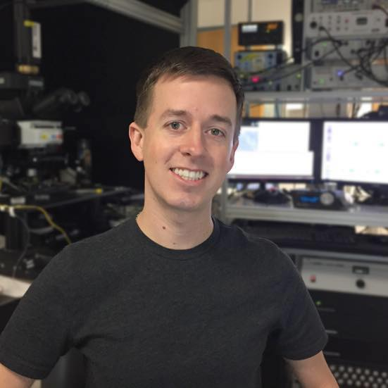
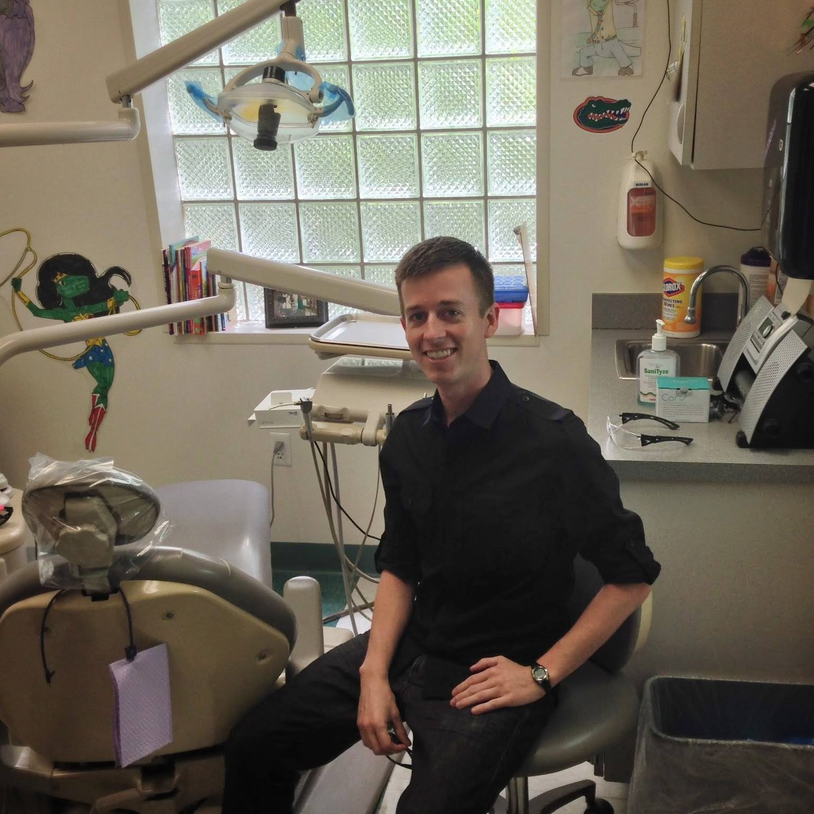
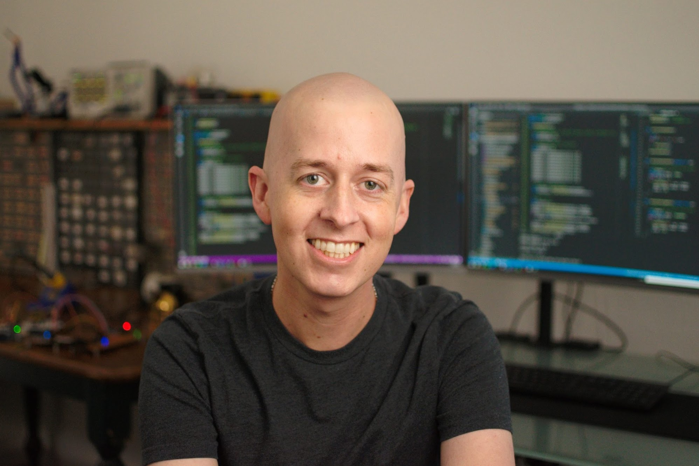

# Scott W Harden, DMD, PhD

**I'm Scott W Harden, and this is my personal website.** Although my formal education is in molecular biology, dentistry, and neuroscience, I am passionate about computer programming and electrical engineering. I use this website to share things I find interesting, with blog posts dating back to 2001 (when I was 15). I only update this page every few years, so the best way to see what I've been up to lately is to [look me up on GitHub](https://github.com/swharden).

## Contact

* [**swharden@gmail.com**](mailto:swharden@gmail.com)

* [**Harden Technologies, LLC**](https://tech.swharden.com/)

## Links

* [**YouTube**](https://www.youtube.com/SWHarden)

* [**GitHub**](https://github.com/swharden)

* [**Google Scholar**](https://scholar.google.com/citations?user=egCaj-AAAAAJ&hl=en)

## Education

* **Associate of Science (AS)** _Biology_

* **Bachelor of Science (BS)** _Zoology major, Chemistry minor_

* **Master of Science (MS)** _Molecular Biology and Microbiology (biotechnology)_ University of Central Florida

* **Doctor of Dental Medicine (DMD)** _Dental School_ University of Florida College of Dentistry

* **Doctor of Philosophy (PhD)** _Biomedical Science / Neuroscience concentration_ University of Florida College of Medicine

## Career

* **I work as a biological research scientist in a neuroscience laboratory.** My recent work investigates the cellular neurophysiology of hormonal signaling in the brain using a combination of patch-clamp electrophysiology, optogenetics, and two-photon imaging.

* I also do freelance hardware and software development operating as [Harden Technologies, LLC](https://swharden.com/tech/)

* Although I am a dentist, I am not currently treating patients.

## Software Development

As a scientist and a tinkerer I find great value in software which facilitates analyses of experimental data. This experience inclines me to work on software related to scientific data analysis and data visualization.

Technologies I work with: C#/.NET, Python, PHP/SQL, HTML/CSS, Linux, Azure 

Notable projects:

* [**ScottPlot**](https://swharden.com/scottplot/) - a .NET library for creating interactive plots of large datasets

* [**pyABF**](https://swharden.com/pyabf/) - A Python interface for Axon Binary Format (ABF) electrophysiology files

* [**FftSharp**](https://github.com/swharden/FftSharp) - a collection of fast Fourier transform (FFT) tools for .NET

* [**Spectrogram**](https://github.com/swharden/Spectrogram) - a .NET library for creating spectrograms

## Hardware Development

I'm most interested in working on projects at the intersection of measurement and analysis, and also projects related to ultra narrowband data transmission (QRSS). 

Technologies I work with: AVR microcontrollers, C (AVR-GCC), KiCAD, and LTSpice

Notable projects:

* [**USB Frequency Counter**](https://github.com/swharden/USB-Counter)

* [**QRSS Transmitter Systems**](https://github.com/swharden/QRSS-hardware)

* [**Sound Card ECG**](https://github.com/swharden/SoundCardECG)

## Amateur Radio

**I am a licensed amateur radio operator** (call sign AJ4VD, previously KJ4LDF). I own a Yaesu 857-D, and although I rarely operate, when I do I prefer using CW (Morse code) on 7 MHz. I enjoy building radio transmitters, receivers, and test equipment. A landmark blog post is from Jan 16, 2011 when I made my first Morse code contact with a radio transmitter I built from scratch. Although I have experience designing and building receivers as well, I have yet to build a radio frequency transceiver in a single enclosure (this is an ultimate goal of mine).

**I am passionate about QRSS, an ultra-narrowband, low power, slow speed digital communication mode.** The gist is that extremely simple circuits (often fewer than a dozen components) can generate a stable (5 Hz frequency shift keying at 10 MHz) low power signal (milliwatts of RF) to slowly send short messages (about 1 letter per minute) over extremely long distances (globally). These circuits are sometimes termed manned experimental propagation transmitters (MEPTs). To learn more, visit [What is QRSS?](https://www.qsl.net/m0ayf/What-is-QRSS.html) and look over my blog posts tagged with QRSS. 

I developed the following projects used by the amateur radio and QRSS community:

* [**FSKview**](https://swharden.com/software/FSKview/) - A high resolution spectrogram for viewing FSK signals in real time
Also worth noting is my ongoing real-time QRSS Plus project.

* [**QRSS Plus**](https://swharden.com/qrss/plus/) - Automatically-Updating Active QRSS Grabber List

## Medical Updates

**I was diagnosed with cancer** in 2012 and began treatment in 2018-2019. Treatments for my [peripheral T-cell lymphoma](https://lymphoma.org/aboutlymphoma/nhl/ptcl/) have included chemotherapy, radiation treatment, and an autologous bone marrow transplant. My medical updates are chronicled on [swharden.com/med](https://www.swharden.com/med/).

If this website hasn't been updated in a while, you can verify that I'm doing well by seeing [recent activity on GitHub](https://github.com/swharden).